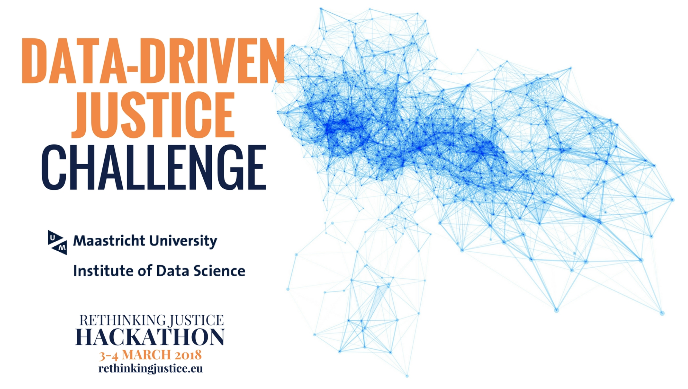

# Data Driven Justice Challenge

More information [rethinkingjustice.eu](http://rethinkingjustice.eu/home/the-challenges/data-driven-justice/)

The rise of open data coupled with increasingly powerful methods in data science and artificial intelligence offers unparalleled opportunities to gain insight into, and make predictions of, human criminal behaviour. Simultaneously, we have a collective responsibility to ensure that data and methods are used in a responsible manner. Data-driven justice aims to harness the power of big data and cutting-edge data science technologies to find ways to maximize fairness, reduce criminality, and improve the delivery of justice.

## What is this challenge about?
The challenge is to find and use open data to inform community groups and law enforcement within Europe. For instance, we could explore optimal allocation of policing resources to make high crime areas safer for residents. Alternatively, we might explore whether bias in policing practice leads to disproportionate incarceration of minority populations. Throughout the challenge, participants must make explicit effort to identify and potentially address social, legal and ethical issues related to the administration of justice.
